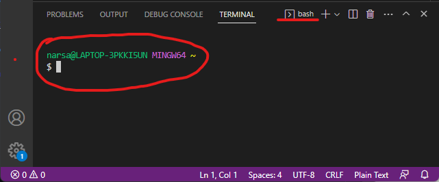
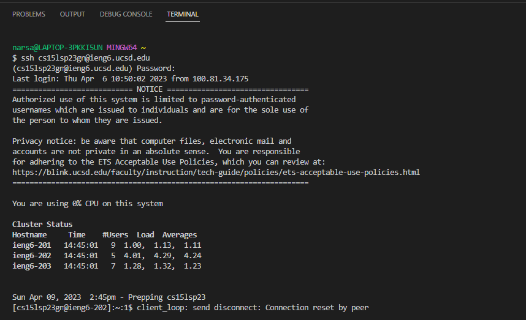

# Remote Access and FileSystem (Week 1)

*Welcome to CSE 15L! This tutorial will help you log into a course-specific account on ieng6*

### Installing VScode

* Visit the [Visual Studio Code Website](https://code.visualstudio.com/) and follow the download instructions for your operating system
* After following the download instructions, VScode should look like this:

### Remotely Connecting
*This step involves using VScode/terminal to connect and work on a remote computer over the internet*

* To install Git, windows users must access this [link](https://gitforwindows.org/) and follow download instructions
* Upon installation, you will need to set git bash as your default terminal. Instructions for this can be found [here](https://stackoverflow.com/questions/42606837/how-do-i-use-bash-on-windows-from-the-visual-studio-code-integrated-terminal/50527994#50527994)
* If the steps were followed correctly, your terminal (CTRL + SHIFT + ') should look like this :

* In order to use ssh, you will have to type the following command in the terminal:

  `$ ssh cs15lsp23XX@ieng.ucsd.edu` (XX will be replaced by the corresponding letters from your account)

* After you run this command, you will be asked to answer an authenticity question, to which you should respond yes.
* Now you will be prompted to enter the password for your account. (Note : When you start typing, there will be no changes on the screen, but type your entire password and press enter to continue)
* If connected successfully, your terminal should look like this:

* You have successfuly set up a remote connection

### Trying some commands

*Now you can run different commands on both your computer and the remote computer*

* Here is a [list of commands](https://tutorials.codebar.io/command-line/introduction/tutorial.html) you can try

* You are encouraged to try different commands and take note of the things that lead to errors

* There are two ways to log out of the remote server :

        1. CTRL + D
        2. Run `exit` in the terminal

