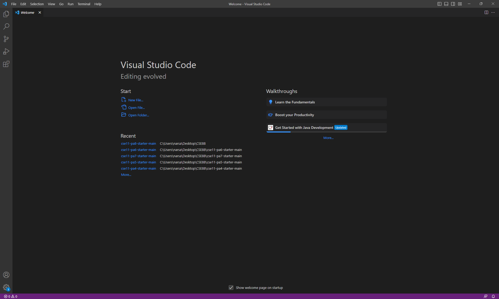

# Remote Access and FileSystem (Week 1)

*Welcome to CSE 15L! This tutorial will help you log into a course-specific account on ieng6*

## Installing VScode

* Visit the [Visual Studio Code Website](https://code.visualstudio.com/) and follow the download instructions for your operating system
* After following the download instructions, VScode should look like this:

