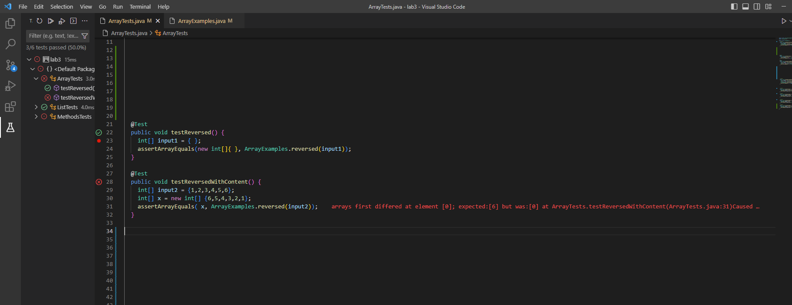

# Lab report 2

**This lab report consists of 3 parts**

## Part 1

* The code consists of 2 files

```
#StringServer.java
import java.io.IOException;
import java.net.URI;

class Handler implements URLHandler {
    // The one bit of state on the server: a number that will be manipulated by
    // various requests.
    int num = 0;
    String x = "";
  
    public String handleRequest(URI url) {
        if(url.getPath().equals("/add-message")){
            String[] param = url.getQuery().split("=");
            if(x == ""){
                x = param[1] + "\n";
            }
            else{
            x = x + param[1] + "\n";
            }
            return String.format(x);
        }
        return "";
    }
}

class StringServer {
    public static void main(String[] args) throws IOException {
        if(args.length == 0){
            System.out.println("Missing port number! Try any number between 1024 to 49151");
            return;
        }
        int port = Integer.parseInt(args[0]);
        Server.start(port, new Handler());
    }
}

```

```
#Server.java
// A simple web server using Java's built-in HttpServer

// Examples from https://dzone.com/articles/simple-http-server-in-java were useful references

import java.io.IOException;
import java.io.OutputStream;
import java.net.InetSocketAddress;
import java.net.URI;

import com.sun.net.httpserver.HttpExchange;
import com.sun.net.httpserver.HttpHandler;
import com.sun.net.httpserver.HttpServer;

interface URLHandler {
    String handleRequest(URI url);
}

class ServerHttpHandler implements HttpHandler {
    URLHandler handler;
    ServerHttpHandler(URLHandler handler) {
      this.handler = handler;
    }
    public void handle(final HttpExchange exchange) throws IOException {
        // form return body after being handled by program
        try {
            String ret = handler.handleRequest(exchange.getRequestURI());
            // form the return string and write it on the browser
            exchange.sendResponseHeaders(200, ret.getBytes().length);
            OutputStream os = exchange.getResponseBody();
            os.write(ret.getBytes());
            os.close();
        } catch(Exception e) {
            String response = e.toString();
            exchange.sendResponseHeaders(500, response.getBytes().length);
            OutputStream os = exchange.getResponseBody();
            os.write(response.getBytes());
            os.close();
        }
    }
}

public class Server {
    public static void start(int port, URLHandler handler) throws IOException {
        HttpServer server = HttpServer.create(new InetSocketAddress(port), 0);

        //create request entrypoint
        server.createContext("/", new ServerHttpHandler(handler));

        //start the server
        server.start();
        System.out.println("Server Started! Visit http://localhost:" + port + " to visit.");
    }
}

```

* Here are two screenshots that show results of the following paths : 


    * */add-message?s=CSE15L IS FUN!*
    	
    
    In the screenshot above, when the Server is started, the main method is run, and the port number is read from the           terminal. Then the .start() method starts the server at the provided host
    
    Once the server is started, `/add-message?s=CSE15L IS FUN!` is added to the URL. The handleRequest mthod is then called     which takes in url of type URI. The purpose of this method is to read the url and determine if a path and/or query is       present. If not, it displays a default output, which in this case is an empty string.
    
    The .getPath() method obtains the path part of the url and using the .equals method, determines that the path is to add     a message. Then the getQuery method obtains the query part of the url. The query is then split at '=' to obtain the         array 'param'. The string is then concatenated with "\n" so that the next output is returned on a new line. In this         case, the element at param[1] is "CSE15L IS FUN!", which is then returned and displayed on the webpage.
    
    
    
    * */add-message?s=This is lab report 2*
    	
    
    The server has already been started, and there is already text from the previous query being displayed. When I entered
    `/add-message?s=This is lab report 2` in the url, the same process from the previous screenshot was used to determine       the path and query. param[1] was holding the String "This is lab report 2". The same steps are repeated and the string     is returned in a new line. 

## Part 2

* The faliure inducing code : 


````
@Test
  public void testReversedWithContent() {
    int[] input2 = {1,2,3,4,5,6};
    int[] x = new int[] {6,5,4,3,2,1};
    assertArrayEquals( x, ArrayExamples.reversed(input2));
  }

 ````
 
 * An input that does not induce a faliure :
 
```
  @Test
  public void testReversed() {
    int[] input1 = { };
    assertArrayEquals(new int[]{ }, ArrayExamples.reversed(input1));
  }
```

* Upon running the two tests in the screenshot below, it was evident that the method needed correction

    
    
* The code needed a few minor changes to be corrected

````
#before
  static int[] reversed(int[] arr) {
    int[] newArray = new int[arr.length];
    for(int i = 0; i < arr.length; i += 1) {
      arr[i] = newArray[arr.length - i - 1];
    }
    return arr;
  }

````


* The first correction made to the code was that in the 4th line, instead of overwriting the values of arr[], the code was   corrected so that the values from arr[] were added to newArray in reverse order.
 
* The second correction was that the return statement was changed to return newArray instead of arr, since newArray           contains the reversed list.


```
#after
  static int[] reversed(int[] arr) {
    int[] newArray = new int[arr.length];
    for(int i = 0; i < arr.length; i += 1) {
      newArray[i] = arr[arr.length - i - 1];
    }
    return newArray;
  }

```

## Part 3

Something I learned from lab in week2 and 3 was how a web server can be started. I also learned how we can write code that can read the URL and identify what query is being run. Lastly, I learned how to code for a server to read a query and perform the query by displaying a given string on the webpage.
