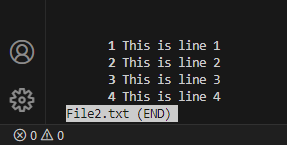
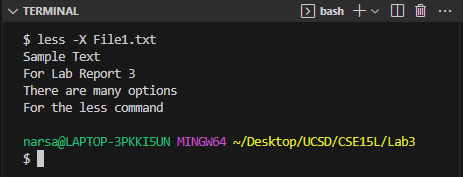
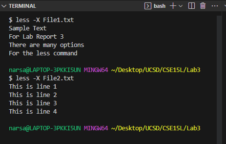
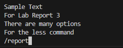
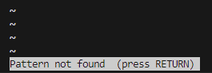
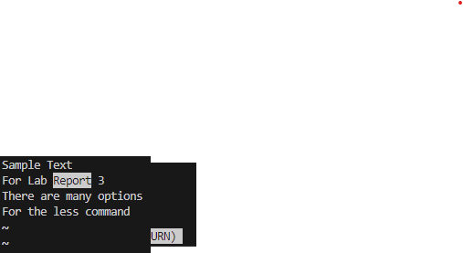
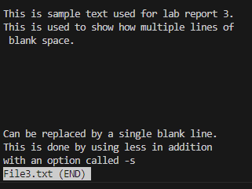
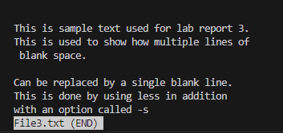

# Lab Report 3

## Command Selected : `less`

Less is a command line utility that is used to display file contents or a command output.
This is done one page at a time. There are many options for users when they are using the
less command.

The general syntax for `less` is :

```
less [OPTIONS] [filename or file location]
```


### The first option for the `less` command is `-N` (Source [here](https://linuxize.com/post/less-command-in-linux/#how-to-use-less)) 

This option displays the line numbers at the beginning of each line

Here are two examples : 

The text file 'File1.txt' contains the following text : 
Sample Text
For Lab Report 3
There are many options
For the less command

Upon running the command : 

```
less -N File1.txt
```
This was the result on the terminal : 

	

The text file 'File2.txt' contains the following text : 
This is line 1
This is line 2
This is line 3
This is line 4

Upon running the commad : 

```
less -N File2.txt
```

This was the result on the terminal:

	

This shows that each line of the text file is now numbered, this is helpful because it makes it easier to refer to the text because each line has a corresponding number.

### The second option for the `less` command is `-X`(Source [here](https://linuxize.com/post/less-command-in-linux/#how-to-use-less)) 

This option leaves file contents on the screen even when less exits

Here are two examples : 

Upon running the command : 

```
less -X File1.txt
```
This was the result on the terminal




Upon running the command : 

```
less -X File2.txt
```
This was the result on the terminal : 




This shows that even when less exits, the file contents remained on the terminal. This is helpful because it makes it easy to write commands based on the file contents, since the contents visible.


### The third option for the `less` command is `-i` (Source [here](https://phoenixnap.com/kb/less-command-in-linux)) 

This option ignores case sensitivity during search. This is better explained in the two examples below. To help understand the use of this command, one example is run without the `-i` option, and the second is run with the `-i` command

Upon running the commands : 

```
less File1.txt
/report
```
The terminal could not find 'report' in the file, however, we know that File1.txt contains 'Report' in line 2. (Take not of the cases)






Upong running the following commands : 

```
less -i File1.txt
/report
```
The terminal was able to find 'Report' (captial R) even though the string searched for was 'report' (lower case r)




This shows that using the option `-i` is able to search for a string in a file regardless of the case sensitivity. This is useful because it enables us to search for all instances of a string, regardless of the case, instead of using multiple search queries for all possible cases.


### The fourth option for the `less` command is `-s` (Source [here](https://phoenixnap.com/kb/less-command-in-linux)) 

The purpose of this option is to merge consecutive blank lines into a single blank line. Two examples will be used to demonstrate how this option works. The first example will show how blank spaces are displayed. The second example will show how the spaces are merged into one single blank line.


Upon running the following command : 

```
less File3.txt
```
The terminal displays the file contents : 



We can see that there are consecutive lines of blank spaces in the file.

Upon running the following command :

```
less -s File3.txt
```


We can see that the blank spaces have been merged into a single blank line


This option is useful because it makes the file easier to read in the terminal. Blank spaces take up a lot of space in the terminal, and using this option makes the text file display seem more consice and easier to read.


