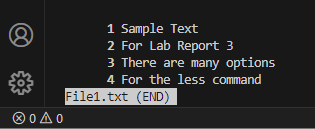

# Lab Report 3

## Command Selected : `less`

Less is a command line utility that is used to display file contents or a command output.
This is done one page at a time. There are many options for users when they are using the
less command.

The general syntax for `less` is :

```
less [OPTIONS] [filename or file location]
```


### The first option for the `less` command is `-N`

This option displays the line numbers at the beginning of each line

Here are two examples : 

The text file 'File1.txt' contains the following text : 
Sample Text
For Lab Report 3
There are many options
For the less command

Upon running the command : 

```
less -N File1.txt
```
This was the result on the terminal : 

	

The text file 'File2.txt' contains the following text : 
This is line 1
This is line 2
This is line 3
This is line 4

Upon running the commad : 

```
less -N File2.txt
```

This was the result on the terminal:

	

This shows that each line of the text file is now numbered, this is helpful because it makes it easier to refer to the text because each line has a corresponding number.


### The second option for the `less` command is `-X`

This option leaves file contents on the screen even when less exits

Here are two examples : 

Upon running the command : 

```
less -X File1.txt
```
This was the result on the terminal


Upon running the command : 

```
less -X File2.txt
```
This was the result on the terminal : 


This shows that even when less exits, the file contents remained on the terminal. This is helpful because it makes it easy to write commands based on the file contents, since the contents visible.


