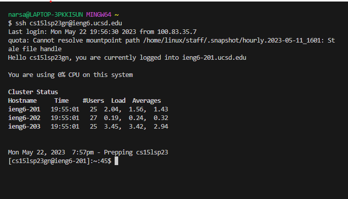
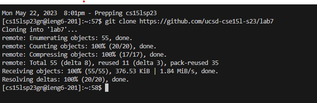
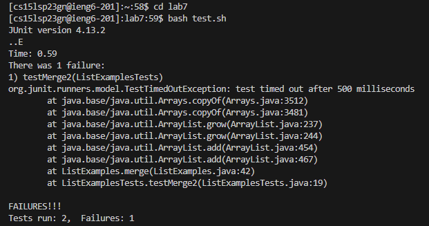
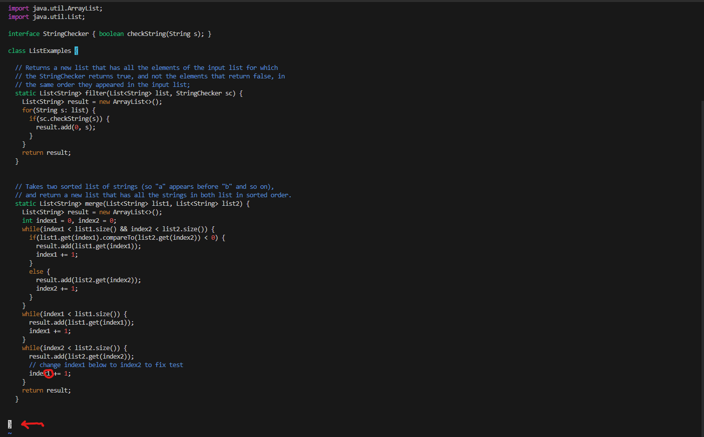
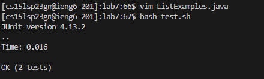
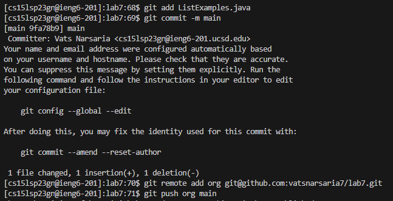

# Lab Report 4

Before you for the repository, make sure you delete any existing forks of the repository you have on your account

## Logging in to ieng6

Keys pressed to log in : 

`ssh cs15lsp23gn@ieng6.ucsd.edu` then `<enter>`

## Cloning your fork of the repository from your GitHub account

`git clone https://github.com/ucsd-cse15l-s23/lab7` then `<enter>` 

## Running the tests

Move to the lab7 directory using the following key presses :

`cd lab7` then `<enter>`

To run the tests :

`bash test.sh` then `<enter>`

## Editing the code using vim

Open file in vim :

`vim ListExamples.java` then `<enter>`

You are in normal mode, take note of your cursor position. In this example, the cursor is in the bottom left corner
The cursor can be seen in the screenshot (marked by red arrow). It needs to move up to the circled character '1'

To move up by 6 lines and left by 11 places : 

`<up><up><up><up><up><up>lllllllllll`

Now delete the existsing '1' character : 

press `x`

Now enter insert mode and replace the removed character by '2', the go back to normal mode and save then quit :

`i2<escape>:wp` then `<enter>`

## Running the tests after edit

`bash test.sh` then `<enter>`

## Commit and push the resulting change to your Github Account

To commit and push changes : 

`git add ListExamples.java` then `<enter>`

`git commit -m main` then `<enter>`

Create a save location as the origin
Take note that ssh will be used when pushing :

`git remote add org git@github.com:vatsnarsaria7/lab7` then `<enter>`

`git push org main`

  
  
  
