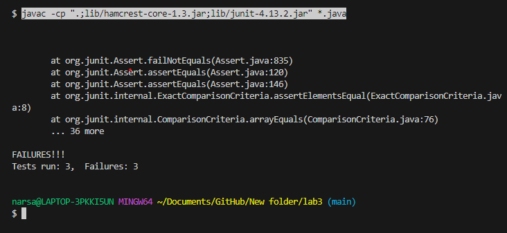

# Lab report 5

## This is the student's post explaining the error they are trying to debug

Student's code


Student's initial code


Student's test


Student's tests failing


## Upon reviewing this, this is the TA's response


## Student's code and testers after running bash script for Junit Testing


## Setup information and bug description

To trigger the bugs initially, the student ran the following bash script contained in the test.sh file: 
```
$ javac -cp ".;lib/hamcrest-core-1.3.jar;lib/junit-4.13.2.jar" *.java
$ java -cp ".;lib/junit-4.13.2.jar;lib/hamcrest-core-1.3.jar" org.junit.runner.JUnitCore ArrayTests
```
The content of the files before fixing the bug can be seen in the screenshot above. The file structure was that 
there were 3 files, ArrayExamples.java contained the 3 method written, ArrayTests.java which contained the test cases
and bash.sh which contained the bash script for Junit Testing.
The bugs were correctly identified by the student based on the TA's guidelines. In the reversedInPlace method
the student changed the for loop to iterate arr.length/2 times, and used a temp variable to reverse the order.
In the reversed method, the student corrected the for loop by initializing the index to 0 instead of 1, and iterating 
arr.length times instead of arr.length-1. Then the student changed the code to add values from the input array to the 
output array and returned the output array instead of the input array.
For the last method, the student fixed the IF statement to only output 0.0 when the length of the array is 0 or 1. The
student also fixed the code to divide the sum by arr.length-1 instead of arr.length to take into account that the method
doesn't add the lowest value to the sum.


## Reflection

From my experience in the second half of the quarter, something cool I learned was the use of VIM to edit files.
I didn't know that we can use the terminal to edit files easily, and also find specific text in the file. Another
cool thing I learned was that we can write a bash script for Junit Testing and call it directly to run all the tests.

